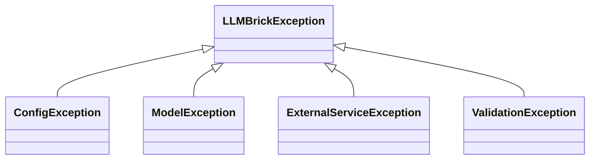

# LLMBrick 異常處理系統設計說明

## 1. 設計目標
- 提供統一、可擴充的異常處理架構，方便框架內部與外部服務、API 層一致處理錯誤。
- 每個異常皆有明確錯誤代碼、訊息與可選詳細資訊，利於 API 回應、日誌記錄與除錯。

## 2. 架構總覽

### 2.1 錯誤代碼體系
- 以 `ErrorCode` Enum 定義所有錯誤代碼，分門別類（如設定、模型、外部服務等）。
- 可依需求擴充。

### 2.2 基礎異常類別
- `LLMBrickException` 為所有框架異常的基底，攜帶 `code`、`message`、`detail`。
- 具備 `to_dict()` 方法，方便序列化為 API 回應。

### 2.3 具體異常子類
- 目前內建：
  - `ConfigException`
  - `ModelException`
  - `ExternalServiceException`
  - `ValidationException`
- 皆繼承自 `LLMBrickException`，並預設對應錯誤代碼。

### 2.4 使用方式
- 框架內 raise 例：
  ```python
  from llmbrick.core.exceptions import ConfigException

  raise ConfigException("設定檔缺少必要欄位", detail={"field": "api_key"})
  ```
- API 層統一捕捉例（FastAPI）：
  ```python
  from fastapi.responses import JSONResponse
  from llmbrick.core.exceptions import LLMBrickException

  @app.exception_handler(LLMBrickException)
  async def llmbrick_exception_handler(request, exc: LLMBrickException):
      logger.error(f"LLMBrickException: {exc}")
      return JSONResponse(
          status_code=400,
          content=exc.to_dict()
      )
  ```

### 2.5 傳播與日誌
- 建議所有自訂異常皆 raise LLMBrickException 或其子類。
- API 層可用 exception_handler 統一轉換為 JSON 回應，並記錄日誌。

## 3. 擴充建議
- 可依需求新增錯誤代碼與異常子類。
- 可於異常 detail 帶入更多除錯資訊（如 stack trace、外部 API 回應等）。

## 4. Mermaid 類別圖


## 5. 檔案位置
- 主要定義於 [`llmbrick/core/exceptions.py`](llmbrick/core/exceptions.py:1)