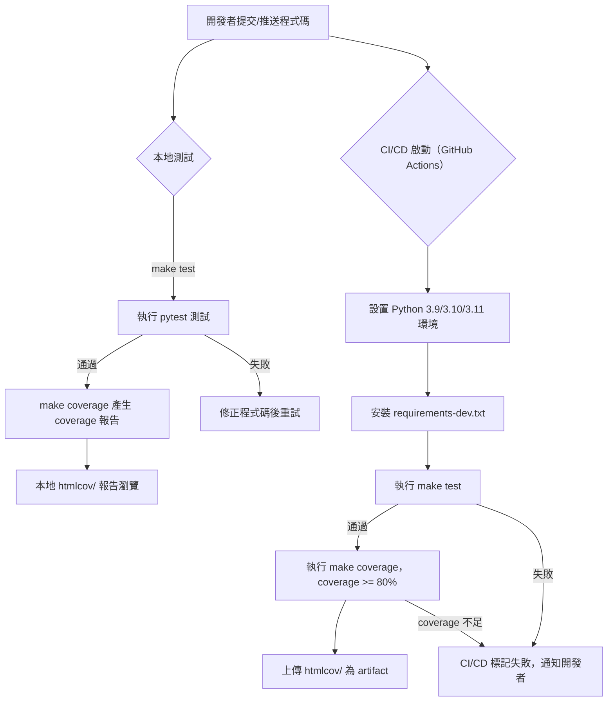

# llmbrick 測試自動化流程說明

本文件說明 llmbrick 專案的完整測試自動化規劃與執行流程，包含目錄結構、coverage/mock 策略、本地與 CI/CD 流程。

---

## 測試目錄結構

- `tests/unit/`：單元測試，針對單一模組或函式進行測試
- `tests/integration/`：整合測試，測試多模組協作或外部服務串接
- `tests/e2e/`：端對端測試，模擬實際使用情境的全流程測試

---

## Coverage 與 Mock 策略

- 使用 `pytest-cov` 產生 coverage 報告，coverage 門檻 80%
- coverage 報告格式：html 與 term
- 優先使用 `pytest-mock` 進行 mock，必要時可用 `unittest.mock`
- coverage 忽略規則：可於 `.coveragerc` 設定（如 __init__.py、proto 產生檔等）

---

## 本地測試流程

### 安裝與環境準備

1. （可選）建立並啟動 Python 虛擬環境
   ```
   python3 -m venv .venv
   source .venv/bin/activate
   ```
2. 安裝開發依賴
   ```
   pip install -r requirements-dev.txt
   ```
3. 安裝 llmbrick 為可編輯模式
   ```
   pip install -e .
   ```

### 執行測試

- 一鍵執行所有測試：`make test`
- 產生 coverage 報告：`make coverage`
- coverage 報告輸出於 `htmlcov/`，可直接瀏覽 `htmlcov/index.html`

---

## CI/CD 自動化測試流程（GitHub Actions）

- 於 `.github/workflows/python-test.yml` 設定
- 支援 Python 3.9、3.10、3.11 多版本測試
- 步驟：
  1. 安裝依賴（pip install -r requirements-dev.txt）
  2. 執行 `make test`
  3. 執行 `make coverage`，coverage 必須 >= 80%
  4. 上傳 `htmlcov/` 為 artifact
- 測試失敗或 coverage 不足時，CI/CD 會標記失敗並通知開發者

---

## Mermaid 測試流程圖



---