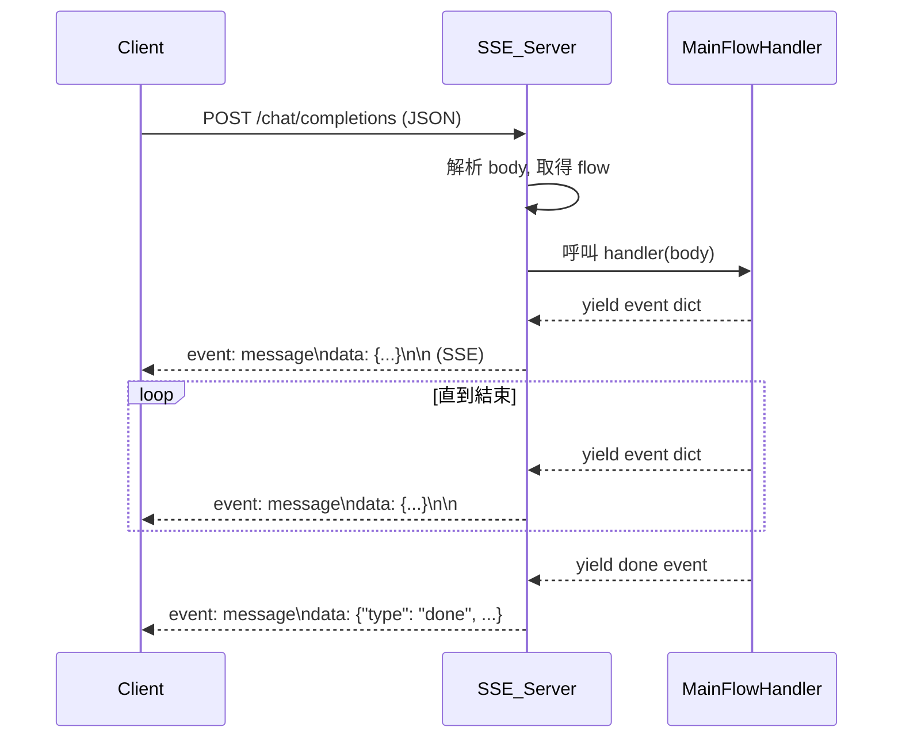

# SSE Server 架構與資料流設計 TODO List

## 1. 盤點現有設計
- [x] 盤點現有 Pipeline class、SSE Server、Brick 組裝邏輯

## 2. 新架構設計原則
- [x] 擬定新架構的設計原則與規範（主程式組裝、型別驗證、錯誤處理）

## 3. 主程式與 API 範例
- [x] 設計主程式組裝 Brick 的範例與 API

## 4. SSE Server 建立與資料流
- [x] 設計 SSE Server 的建立與資料輸入輸出流程（API 路徑、request/response、推送邏輯）

## 5. 高階 API 封裝設計
- [ ] 提供高階 SSEServer/flow 註冊 API，讓開發者可直接組裝 Brick、註冊流程、啟動服務

## 6. 彙整設計草案
- [ ] 彙整設計草案，請你確認與補充

---

## 具體執行步驟

1. **建立 SSE Server 架構**
   - FastAPI/Flask SSE 伺服器
   - 設計 `/chat/completions` 路徑
   - 支援標準 SSE request/response 格式

2. **主程式註冊流程 handler**
   - 支援多流程註冊
   - handler 以 async generator 方式 yield event dict

3. **資料 mapping/adapter 設計**
   - SSE request 轉換為各 Brick 輸入
   - Brick 輸出組裝為 SSE response
   - Adapter 層型別驗證與錯誤處理

4. **高階 API 封裝設計**
   - 提供 SSEServer 物件，開發者只需註冊流程與 Brick，呼叫 run() 即可啟動
   - 設計目標：未來 WebSocket/gRPC 也能用類似高階 API 啟動

---

## 範例內容

### 1. SSE Server FastAPI 範例

```python
from fastapi import FastAPI, Request
from fastapi.responses import StreamingResponse
import json

app = FastAPI()

# 主程式註冊流程 handler
registered_flows = {}

def register_flow(name, handler):
    registered_flows[name] = handler

@app.post("/chat/completions")
async def chat_completions(request: Request):
    body = await request.json()
    flow_name = body.get("flow", "default")
    handler = registered_flows.get(flow_name)
    if not handler:
        return {"error": "Flow not found"}
    # SSE event generator
    async def event_stream():
        async for event in handler(body):
            yield f"event: message\ndata: {json.dumps(event)}\n\n"
    return StreamingResponse(event_stream(), media_type="text/event-stream")
```

---

### 2. 主程式註冊流程 handler 範例

```python
# main.py
from sse_server import register_flow

async def main_flow(request_body):
    # ... yield event dicts ...
    yield {"id": "...", "type": "text", ...}
    yield {"id": "...", "type": "done", ...}

register_flow("default", main_flow)
```

---

### 3. SSE Request → Brick Mapping/Adapter 範例

```python
# 假設收到 SSE Request
sse_request = {
    "model": "gpt-4o",
    "messages": [
        {"role": "system", "content": "Be precise and concise."},
        {"role": "user", "content": "請幫我校正這段文字..."}
    ],
    "stream": True
}

# 1. 解析 user 輸入
user_input = next(m["content"] for m in sse_request["messages"] if m["role"] == "user")

# 2. 組裝 RectifyBrick 輸入
rectify_input = {"text": user_input}
rectified = rectify.run_unary(rectify_input)

# 3. 組裝 IntentionGuardBrick 輸入
intention_input = {"text": rectified["text"]}
intention_result = intention.run_unary(intention_input)
if not intention_result["allow"]:
    # 回傳 SSE Response: type=meta, progress=DONE, error
    yield sse_event({
        "id": "xxx",
        "type": "meta",
        "progress": "DONE",
        "error": "意圖不符"
    })
    return

# 4. 組裝 LLMBrick 輸入
llm_input = {
    "prompt": rectified["text"],
    "model": sse_request["model"]
}
llm_result = llm.run_unary(llm_input)

# 5. 組裝 ComposeTranslateBrick 輸入
compose_input = {
    "original": user_input,
    "llm_output": llm_result["text"]
}
composed = compose.run_unary(compose_input)

# 6. 組裝 SSE Response
yield sse_event({
    "id": "xxx",
    "type": "text",
    "model": sse_request["model"],
    "text": composed["translated"],
    "progress": "IN_PROGRESS",
    "context": {"conversation_id": "..."},
    "metadata": {}
})
yield sse_event({
    "id": "xxx",
    "type": "done",
    "progress": "DONE"
})
```

---

### 4. Mermaid 流程圖



---

### 5. 高階 API 封裝設計與範例

- 提供 SSEServer 物件，開發者只需註冊流程與 Brick，呼叫 run() 即可啟動
- 範例（參考 README.md）：

```python
from llmbrick import Pipeline, OpenAILLM
from llmbrick.servers.sse import SSEServer

pipeline = Pipeline()
pipeline.add_brick(OpenAILLM(api_key="your-api-key"))

server = SSEServer(pipeline)
server.run(host="0.0.0.0", port=8000)
```

- 設計目標：未來 WebSocket/gRPC 也能用類似高階 API 啟動

---

> 本 todo_list.md 依照目前討論進度整理，包含所有細節、範例程式與流程圖，供後續開發與追蹤。