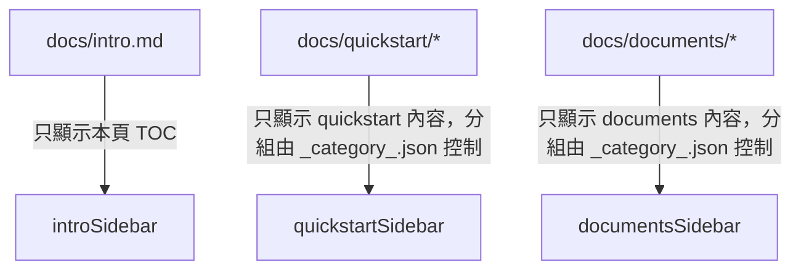

# Docusaurus Sidebar 與目錄規劃方案

## 1. intro.md sidebar 只顯示本頁 heading anchors

- intro.md 不掛 sidebar，只顯示本頁 TOC（heading anchors）。
- 實現方式：
  - 需在 `docusaurus.config.ts` 設定 docs plugin 的 sidebarPath 為 `null` 或自訂 sidebar，或用自訂頁面 layout（如用 `@theme/DocItem` 覆寫）。
  - 這樣 sidebar 不會顯示其他文件，只會顯示本頁 TOC（右側浮動目錄）。

## 2. quickstart、documents 目錄 sidebar 規劃

- 每個目錄下 sidebar 只顯示該資料夾內容，且每個子資料夾都用 `_category_.json` 自訂分組標籤。
- 實現方式：
  - `sidebars.ts` 設定多個 sidebar，分別對應 quickstart、documents。
  - 每個子資料夾下放置 `_category_.json`，內容如下：
    ```json
    {
      "label": "自訂分組名稱",
      "position": 1,
      "collapsed": false
    }
    ```
  - 這樣 sidebar 會自動以分組顯示。

## 3. sidebars.ts 範例

```ts
const sidebars = {
  // intro.md 不掛 sidebar，或掛一個空 sidebar
  introSidebar: [],
  // quickstart 目錄
  quickstartSidebar: [{ type: 'autogenerated', dirName: 'quickstart' }],
  // documents 目錄
  documentsSidebar: [{ type: 'autogenerated', dirName: 'documents' }],
};
export default sidebars;
```

## 4. docusaurus.config.ts docs plugin 多 instance 範例

```ts
presets: [
  [
    'classic',
    /** @type {import('@docusaurus/preset-classic').Options} */
    {
      docs: [
        {
          id: 'intro',
          path: 'docs',
          routeBasePath: 'docs',
          sidebarPath: require.resolve('./sidebars.ts'),
          sidebarItemsGenerator: async () => [], // intro.md 不顯示 sidebar
        },
        {
          id: 'quickstart',
          path: 'docs/quickstart',
          routeBasePath: 'docs/quickstart',
          sidebarPath: require.resolve('./sidebars.ts'),
          sidebarItemsGenerator: undefined, // 使用 quickstartSidebar
        },
        {
          id: 'documents',
          path: 'docs/documents',
          routeBasePath: 'docs/documents',
          sidebarPath: require.resolve('./sidebars.ts'),
          sidebarItemsGenerator: undefined, // 使用 documentsSidebar
        },
      ],
      // ...其他設定
    },
  ],
],
```

## 5. _category_.json 範例

- 放在 `docs/quickstart/`、`docs/quickstart/子資料夾/`、`docs/documents/`、`docs/documents/子資料夾/` 下
```json
{
  "label": "分組名稱",
  "position": 1,
  "collapsed": false
}
```

---

## Mermaid 結構圖



---

## 實作重點

- intro.md 需自訂頁面 layout 或 plugin，讓 sidebar 不顯示其他文件，只顯示本頁 TOC。
- quickstart、documents 目錄下每個子資料夾都放 _category_.json，sidebar 會自動分組。
- sidebars.ts 設定多個 sidebar，docusaurus.config.ts 設定多 docs instance 或用 routeBasePath 控制。

---

請確認此規劃是否符合你的需求，或有任何細節要調整。