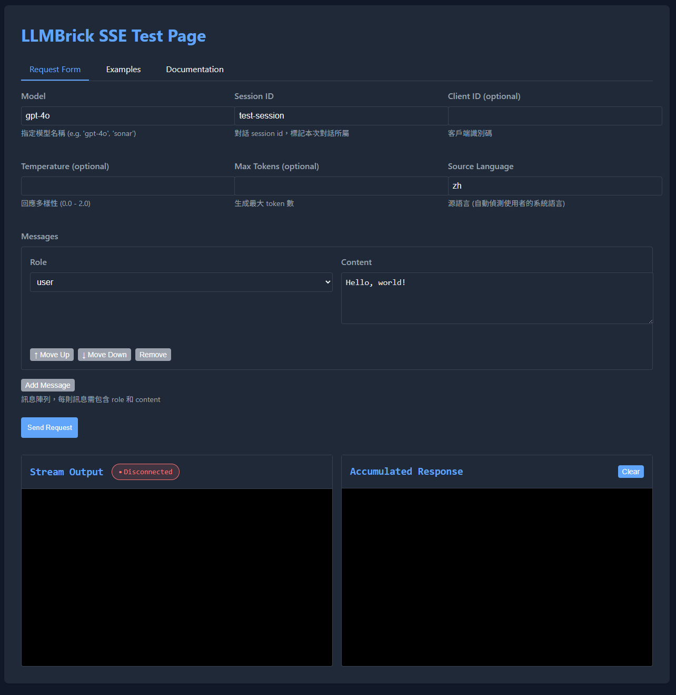

# SSE Server

## 概述

LLMBrick SSE Server 是一個基於 FastAPI 的 Server-Sent Events (SSE) 服務器，專為大型語言模型對話應用設計。它提供了完整的型態安全、錯誤處理和開發者友善的配置選項。

## 特色功能

- ✅ **完整的型態安全保障** - 嚴格的輸入輸出驗證
- ✅ **業務邏輯驗證** - 可配置的模型清單、訊息長度限制等
- ✅ **結構化錯誤處理** - 詳細的錯誤訊息和異常處理
- ✅ **開發者友善** - 可配置的除錯模式和日誌記錄
- ✅ **向後相容** - 支援現有的初始化方式
- ✅ **易於測試** - 提供測試工具和範例幫助開發者驗證應用

## 快速開始

### 預設 SSE URL

SSE Server 預設的 SSE API 路徑為：

- `POST /chat/completions`
  - 這個路徑可透過 `SSEServerConfig.chat_completions_path` 或建構子參數自訂，未指定時預設為 `/chat/completions`。
  - 若有設定 `prefix`，則完整路徑為 `/{prefix}/{chat_completions_path}`，例如 `/api/v1/chat/completions`。
  - 測試頁面預設於 `/` 路徑（需啟用 `enable_test_page`）。

請確保前端與測試工具請求的路徑與伺服器設定一致，否則會出現 404 錯誤。

### 基本使用

```python
from llmbrick.servers.sse.server import SSEServer
from llmbrick.protocols.models.http.conversation import ConversationSSEResponse, ConversationSSERequest

# 創建 SSE Server
server = SSEServer()

# 定義處理函數
@server.handler
async def my_handler(request_data: ConversationSSERequest):
    """
    request_data: ConversationSSERequest
    """
    # 處理邏輯
    yield ConversationSSEResponse(
        id="msg-1",
        type="text",
        text="Hello World",
        progress="IN_PROGRESS"
    )
    
    yield ConversationSSEResponse(
        id="msg-2",
        type="done",
        progress="DONE"
    )

# 啟動服務器
server.run(host="0.0.0.0", port=8000)
```

### 使用配置類別

```python
from llmbrick.servers.sse.server import SSEServer
from llmbrick.servers.sse.config import SSEServerConfig

# 創建配置
config = SSEServerConfig(
    host="127.0.0.1",
    port=9000,
    debug_mode=True,
    allowed_models=["gpt-4o", "claude-3"],
    max_message_length=5000,
    enable_request_logging=True
)

# 使用配置創建服務器
server = SSEServer(config=config)

@server.handler
async def advanced_handler(request_data: ConversationSSERequest):
    """
    request_data: ConversationSSERequest
    """
    # 配置會自動驗證請求
    # 業務邏輯處理...
    pass

server.run()
```

---

## SSE Server 類別參數與操作說明

### SSE Server 建構子參數

```python
SSEServer(
    handler: Optional[Callable[[ConversationSSERequest], AsyncGenerator[ConversationSSEResponse, None]]] = None,
    config: Optional[SSEServerConfig] = None,
    chat_completions_path: Optional[str] = None,
    prefix: Optional[str] = None,
    custom_validator: Optional[Any] = None,
    enable_test_page: bool = False,
)
```

| 參數名稱              | 類型/預設值         | 說明                                                                                   |
|----------------------|---------------------|----------------------------------------------------------------------------------------|
| `handler`            | Callable/None       | 主 SSE 處理函數，必須為 async generator，負責處理每個請求並 yield `ConversationSSEResponse`。可用裝飾器或 set_handler 設定。|
| `config`             | SSEServerConfig/None| 伺服器設定物件，詳細參見下方「SSEServerConfig」。未提供時會自動建立預設設定。                |
| `chat_completions_path` | str/None         | API 路徑（舊版相容），如 `/chat/completions`。若有設定會覆蓋 config 內對應欄位。             |
| `prefix`             | str/None            | API 路徑前綴（舊版相容），如 `/api`。若有設定會覆蓋 config 內對應欄位。                      |
| `custom_validator`   | Any/None            | 自定義驗證器，需實作 `validate(request, ...)` 靜態方法。可用於特殊業務驗證。                 |
| `enable_test_page`   | bool/False          | 是否啟用內建測試頁面（僅開發/測試用）。啟用後可於 `/` 路徑存取互動測試頁。                   |

#### 參數互動與注意事項

- `config`、`chat_completions_path`、`prefix` 會互相覆蓋，優先順序為：建構子參數 > config 物件 > 預設值。
- `handler` 可於初始化時傳入，也可後續用 `@server.handler` 裝飾器或 `set_handler()` 設定。
- `custom_validator` 若有設定，會取代預設驗證器，於每次請求時進行業務驗證。
- `enable_test_page=True` 時，需確保 `llmbrick/servers/sse/templates/test_page.html` 存在，否則會有警告。

---

### 參數實例與操作範例

#### 1. 設定自訂 API 路徑與前綴

```python
server = SSEServer(
    prefix="/api/v1",
    chat_completions_path="/mychat"
)
# API 實際路徑為 /api/v1/mychat
```

#### 2. 註冊主 handler（兩種方式）

- **建構子傳入：**
  ```python
  async def my_handler(request_data: ConversationSSERequest):
      """
      request_data: ConversationSSERequest
      """
      yield ConversationSSEResponse(...)
  server = SSEServer(handler=my_handler)
  ```

- **裝飾器註冊：**
  ```python
  server = SSEServer()
  @server.handler
  async def my_handler(request_data: ConversationSSERequest):
      """
      request_data: ConversationSSERequest
      """
      yield ConversationSSEResponse(...)
  ```

#### 3. 啟用測試頁面

```python
server = SSEServer(enable_test_page=True)
# 啟動後可於 http://localhost:8000/ 互動測試
```

#### 4. 使用自定義驗證器

```python
class MyValidator:
    @staticmethod
    def validate(request, allowed_models=None, max_message_length=10000, max_messages_count=100):
        # 基本驗證
        ...
        # 自訂規則
        if request.temperature > 2.0:
            raise ValidationException("Temperature too high")

server = SSEServer(custom_validator=MyValidator())
```

#### 5. 啟用 HTTPS (TLS)

若需以 HTTPS 提供 SSE 服務，可在啟動時傳入 SSL 私鑰與憑證檔案：

```python
server = SSEServer()
server.run(
    host="0.0.0.0",
    port=8443,
    ssl_keyfile="/etc/ssl/private/server.key",
    ssl_certfile="/etc/ssl/certs/server.pem"
)
```

- `ssl_keyfile` 指向伺服器私鑰檔案 (`.key` 或 `.pem`)。
- `ssl_certfile` 指向公開憑證或憑證鏈檔案。
- 兩個參數需同時提供，路徑需對執行程序可讀；若憑證有誤，`uvicorn` 會在啟動時拋出例外。

---

### 操作流程與常見問題

#### 路徑組合規則

- `prefix` 與 `chat_completions_path` 會自動補齊 `/`，避免重複或遺漏。
- 例如：`prefix="/api"`, `chat_completions_path="chat"` → 實際路徑為 `/api/chat`

#### Handler 設定失敗

- 若未設定 handler，API 會回傳 404 錯誤。
- 測試頁面會顯示警告：「No handler is configured. Requests will fail until a handler is set.」

#### 測試頁面模板遺失

- 若 `test_page.html` 不存在，啟動時會有 logger 警告，但不影響主 API 運作。

#### 自定義驗證器錯誤

- 若驗證器未正確實作 `validate` 靜態方法，請求會直接失敗，建議參考預設驗證器實作。

---

### 進階：SSE Server 主要方法

- `set_handler(func)`：直接設定主 handler，會自動重設路由。
- `handler(func)`：裝飾器用法，註冊主 handler。
- `run(host=None, port=None, ssl_keyfile=None, ssl_certfile=None)`：啟動伺服器，host/port 可覆蓋 config 設定，可選擇傳入 SSL 憑證檔案以啟用 HTTPS。
- `fastapi_app`：取得底層 FastAPI app，可用於註冊中間件或自訂路由。

---

### 常見錯誤與排除

- **406 Not Acceptable**：請求 header 缺少 `Accept: text/event-stream`
- **404 Handler not set**：未註冊 handler
- **422 Validation Error**：請求格式或業務驗證失敗
- **測試頁面無法載入**：檢查 `test_page.html` 是否存在於 templates 目錄

---

### 實用建議

- **開發階段建議啟用 `debug_mode` 與 `enable_test_page`，便於除錯與測試。**
- **生產環境請關閉測試頁面，避免資訊外洩。**
- **自訂驗證器時，務必呼叫父類別的 validate 以保證基本驗證不被跳過。**

---

## API 參考

### SSEServerConfig

配置類別提供了豐富的自定義選項：

```python
class SSEServerConfig:
    # 基本配置
    host: str = "0.0.0.0"
    port: int = 8000
    prefix: str = ""
    chat_completions_path: str = "/chat/completions"
    
    # 驗證配置
    allowed_models: List[str] = ["gpt-4o", "gpt-3.5-turbo", "sonar"]
    max_message_length: int = 10000
    max_messages_count: int = 100
    
    # 開發者體驗配置
    debug_mode: bool = False
    enable_request_logging: bool = True
    enable_validation_details: bool = True
    
    # 效能配置
    request_timeout: int = 30
    max_concurrent_connections: int = 100
```

### 請求格式

SSE Server 接受符合 `ConversationSSERequest` 格式的請求：

#### ConversationSSERequest 欄位說明

| 欄位名稱         | 型態         | 必填 | 說明 |
|------------------|--------------|------|------|
| `model`          | str          | ✔    | 指定模型名稱，例如 `"gpt-4o"`、`"sonar"` |
| `messages`       | List[Message]| ✔    | 對話訊息陣列，每則訊息需包含 `role` 與 `content`，詳見下方 |
| `stream`         | bool         | ✔    | 是否啟用串流，SSE 必須為 `true` |
| `clientId`       | str          |      | 客戶端識別碼（選填，前端可自訂） |
| `sessionId`      | str          | ✔    | 對話 session id，標記本次對話所屬 |
| `temperature`    | float        |      | 回應多樣性（選填，0~2，愈高愈隨機） |
| `maxTokens`      | int          |      | 生成最大 token 數（選填） |
| `tools`          | List[Any]    |      | 工具列表（選填，function calling 用） |
| `toolChoice`     | Any          |      | 工具選擇（選填） |
| `sourceLanguage` | str          |      | 源語言（選填，翻譯任務用） |

#### Message 欄位說明

| 欄位名稱 | 型態 | 必填 | 說明 |
|----------|------|------|------|
| `role`   | str  | ✔    | 訊息角色，如 `"system"`、`"user"`、`"assistant"` |
| `content`| str  | ✔    | 訊息內容 |

> **備註：**
> - 所有欄位預設禁止額外欄位（extra="forbid"），多餘欄位會驗證失敗。
> - 欄位名稱支援駝峰式（如 `clientId`、`sessionId`、`maxTokens`）。

#### 範例 JSON

```json
{
    "model": "gpt-4o",
    "messages": [
        {"role": "system", "content": "You are a helpful assistant."},
        {"role": "user", "content": "Hello!"}
    ],
    "stream": true,
    "clientId": "client123",
    "sessionId": "session-123",
    "temperature": 0.7,
    "maxTokens": 1000,
    "tools": [],
    "toolChoice": null,
    "sourceLanguage": "en"
}
```

### 回應格式

服務器回傳符合 `ConversationSSEResponse` 格式的 SSE 事件：

#### ConversationSSEResponse 欄位說明

| 欄位名稱    | 型態                | 必填 | 說明 |
|-------------|---------------------|------|------|
| `id`        | str                 | ✔    | 唯一識別碼（每個事件唯一） |
| `type`      | str                 | ✔    | 資料類型，如 `"text"`、`"meta"`、`"done"` |
| `model`     | str                 |      | 回應的模型名稱（選填） |
| `text`      | str                 |      | 本次串流新文本（選填，通常 type 為 `"text"` 時有值） |
| `progress`  | str                 | ✔    | 進度狀態，`"IN_PROGRESS"` 、 `ERROR` 或 `"DONE"` |
| `context`   | SSEContext          |      | 上下文資訊（選填，包含 conversationId、cursor 等） |
| `metadata`  | SSEResponseMetadata |      | 輔助資訊（選填，包含 searchResults、attachments 等） |

> **型別安全建議：**
> `progress` 欄位建議以 Enum 型式定義於後端程式碼中，避免硬編字串。
> 例如：
> ```python
> from enum import Enum
> class ProgressEnum(str, Enum):
>     IN_PROGRESS = "IN_PROGRESS"
>     DONE = "DONE"
>     ERROR = "ERROR"
> ```
> 回傳時請使用 `ProgressEnum.IN_PROGRESS`、`ProgressEnum.ERROR` 或 `ProgressEnum.DONE`，以提升型別安全與可維護性。

#### SSEContext 欄位說明

| 欄位名稱         | 型態   | 必填 | 說明 |
|------------------|--------|------|------|
| `conversationId` | str    |      | 對話 ID（選填） |
| `cursor`         | str    |      | 游標（選填，串流進度追蹤） |

#### SSEResponseMetadata 欄位說明

| 欄位名稱      | 型態   | 必填 | 說明 |
|---------------|--------|------|------|
| `searchResults`| Any    |      | 搜尋結果（選填，結構依應用而定） |
| `attachments`  | Any    |      | 附件（選填，結構依應用而定） |

> **備註：**
> - 所有欄位預設禁止額外欄位（extra="forbid"），多餘欄位會驗證失敗。
> - 欄位名稱支援駝峰式（如 `conversationId`、`searchResults`）。
> - `progress` 必須為 `"IN_PROGRESS"` 或 `"DONE"`，否則會驗證失敗。

---

### ConversationSSEResponse 靈活運用

雖然 `ConversationSSEResponse` 欄位已明確定義，但開發者可根據需求靈活運用各欄位，實現多樣化的串流互動體驗：

- **進度通知**：可多次回傳 `IN_PROGRESS`，每次帶不同 `text` 或 `metadata`，用於分段訊息、進度條、分批資料等。
- **警告/提示**：可於 `metadata` 增加自訂欄位（如 `warnings`），或於 `type` 設為 `"meta"`，前端可根據 type/metadata 顯示提示。
- **異常/例外**：非致命錯誤（如部分資料缺失、外部 API timeout）可用一則 `type="meta"` 或 `type="text"`，於 `text` 或 `metadata` 說明，並將 `progress` 設為 `"IN_PROGRESS"` 或 `"DONE"`，不會中斷 SSE 流。
- **Meta 資訊**：如搜尋結果、附件、上下文等，皆可放於 `metadata`，前端可依需求解析。
- **分段訊息**：長訊息可拆分多則 `ConversationSSEResponse`，每則帶不同 `id`/`text`，前端可組合顯示。
- **自訂 context**：如需追蹤串流進度、游標、conversationId，可於 `context` 傳遞，前端可用於續傳、定位等進階應用。

#### 靈活運用範例

```python
# 進度條與警告訊息
yield ConversationSSEResponse(
    id="msg-1",
    type="text",
    text="正在處理第 1 步...",
    progress="IN_PROGRESS",
    metadata={"progressPercent": 20}
)
yield ConversationSSEResponse(
    id="msg-2",
    type="meta",
    text="外部 API 回應較慢，請稍候。",
    progress="IN_PROGRESS",
    metadata={"warnings": ["API timeout, fallback to cache"]}
)
yield ConversationSSEResponse(
    id="msg-3",
    type="text",
    text="處理完成！",
    progress="DONE"
)
```

> **建議：**
> 除嚴重錯誤（event: error）外，所有狀態、警告、異常、進度等皆可透過 `ConversationSSEResponse` 彈性通知 client，前端可根據 type/metadata/context 實現多元互動。

#### 範例 JSON

```json
{
    "id": "msg-1",
    "type": "text",
    "model": "gpt-4o",
    "text": "Hello! How can I help you?",
    "progress": "IN_PROGRESS",
    "context": {
        "conversationId": "conv-123",
        "cursor": "cursor-abc"
    },
    "metadata": {
        "searchResults": null,
        "attachments": null
    }
}
```

## 驗證機制

### 輸入驗證

1. **HTTP Header 驗證** - 必須包含 `Accept: text/event-stream`
2. **JSON 格式驗證** - 確保請求體為有效的 JSON
3. **Schema 驗證** - 使用 Pydantic 驗證請求符合 `ConversationSSERequest` 格式
4. **業務邏輯驗證** - 檢查模型名稱、訊息結構、長度限制等

### 輸出驗證

1. **型態檢查** - 確保 handler 回傳 `ConversationSSEResponse` 物件
2. **必要欄位檢查** - 驗證 `id`、`type`、`progress` 等必要欄位
3. **進度狀態檢查** - 確保 `progress` 為有效值 (`IN_PROGRESS` 或 `DONE`)

## SSE 回應 event/data 行為說明

SSE 回應格式為：

```
event: message
data: {...ConversationSSEResponse...}
```

- **event** 欄位預設為 `message`，僅當發生嚴重錯誤（如 schema 驗證失敗、未註冊 handler 等）時才會為 `error`，此時連線將被中斷。
- **一般錯誤/例外**（如業務驗證失敗、外部 API 部分失敗等）建議以 `event: message`，並用 `ConversationSSEResponse` 的 `type`、`text`、`metadata` 等欄位通知 client，讓前端可彈性處理顯示、重試、提示等。
- 嚴重錯誤（如 422 schema error、404 handler not set）才會回傳 `event: error`，格式如下：

```
event: error
data: {"error": "Business validation failed", "details": "..."}
```

- 其他所有狀態、警告、異常、進度等，皆建議以 `event: message` + `ConversationSSEResponse` 回傳，避免中斷 SSE 連線。

## 錯誤處理

### HTTP 錯誤碼

- `400` - 請求格式錯誤（無效 JSON、空請求等）
- `406` - 缺少 `Accept: text/event-stream` header
- `422` - 請求 schema 驗證失敗
- `404` - Handler 未設定

### SSE 錯誤事件

```
event: error
data: {"error": "Business validation failed", "details": "Unsupported model: invalid-model"}
```

#### 錯誤回報建議

- 嚴重錯誤（如 schema 驗證失敗、handler 缺失）才會以 `event: error` 回傳，並中斷 SSE 連線。
- 其他業務錯誤、例外、警告等，建議以 `event: message`，並用 `ConversationSSEResponse` 的 `type="meta"` 或 `type="text"`，於 `text` 或 `metadata` 說明錯誤細節，讓前端可彈性顯示、提示或重試。
- 例如：

```python
# 非致命錯誤，通知 client
yield ConversationSSEResponse(
    id="warn-1",
    type="meta",
    text="部分資料取得失敗，已使用預設值。",
    progress="IN_PROGRESS",
    metadata={"warnings": ["fallback to default"]}
)
```

### 自定義異常

```python
from llmbrick.core.exceptions import ValidationException

@server.handler 
async def my_handler(request_data):
    if some_condition:
        raise ValidationException("Custom validation error")
    # ...
```

## 開發者使用模式

### 1. 基本聊天機器人

```python
server = SSEServer()

@server.handler
async def chat_handler(request_data):
    # 簡單的回聲機器人
    user_message = request_data["messages"][-1]["content"]
    
    yield ConversationSSEResponse(
        id="response-1",
        type="text",
        text=f"You said: {user_message}",
        progress="DONE"
    )
```

### 2. 流式回應

```python
@server.handler
async def streaming_handler(request_data):
    response_text = "This is a long response that will be streamed..."
    
    for i, char in enumerate(response_text):
        progress = "DONE" if i == len(response_text) - 1 else "IN_PROGRESS"
        
        yield ConversationSSEResponse(
            id=f"chunk-{i}",
            type="text",
            text=char,
            progress=progress
        )
```

### 3. 整合外部 LLM

```python
import openai

@server.handler
async def openai_handler(request_data):
    # 轉換為 OpenAI 格式
    openai_messages = [
        {"role": msg["role"], "content": msg["content"]} 
        for msg in request_data["messages"]
    ]
    
    # 調用 OpenAI API
    response = await openai.ChatCompletion.acreate(
        model=request_data["model"],
        messages=openai_messages,
        stream=True
    )
    
    async for chunk in response:
        if chunk.choices[0].delta.content:
            yield ConversationSSEResponse(
                id=chunk.id,
                type="text",
                text=chunk.choices[0].delta.content,
                progress="IN_PROGRESS"
            )
    
    # 結束標記
    yield ConversationSSEResponse(
        id="final", 
        type="done",
        progress="DONE"
    )
```

## 內建測試頁面

SSE Server 提供了一個開發者友善的測試頁面，可透過 `enable_test_page` 參數啟用：

```python
server = SSEServer(enable_test_page=True)
```

測試頁面功能：

1. **完整的請求配置**
   - 支援所有 ConversationSSERequest 欄位
   - 動態訊息管理（新增/刪除/重排序）
   - 內建欄位說明和類型提示

2. **串流輸出視覺化**
   - 固定高度的輸出區塊，自動捲動到最新訊息
   - 時間戳記標記（HH:MM:SS.mmm）
   - 依訊息類型顯示不同顏色：
     - 一般訊息：預設顏色
     - 錯誤訊息：紅色背景
     - Meta 訊息：藍色背景
     - Done 訊息：綠色背景

3. **使用者體驗優化**
   - 深色/淺色主題切換
   - 支援系統主題偏好
   - 主題設定自動保存
   - 響應式設計，適應不同螢幕大小

4. **開發者工具**
   - API 文件和範例
   - 請求/回應格式說明
   - 欄位描述與規範



要訪問測試頁面，只需在瀏覽器中開啟伺服器根路徑：
```
http://localhost:8000/
```

## 測試你的應用

### 使用 curl 測試

```bash
# 測試基本 SSE 請求
curl -X POST http://localhost:8000/chat/completions \
  -H "Content-Type: application/json" \
  -H "Accept: text/event-stream" \
  -d '{
    "model": "gpt-4o",
    "messages": [
      {"role": "user", "content": "Hello!"}
    ],
    "stream": true,
    "sessionId": "test-session-123"
  }'
```

### 測試你的 Handler

```python
import pytest
from fastapi.testclient import TestClient
from llmbrick.servers.sse.server import SSEServer
from llmbrick.protocols.models.http.conversation import ConversationSSEResponse
from llmbrick.core.error_codes import ErrorCodes

def test_my_handler():
    server = SSEServer()
    
    @server.handler
    async def my_handler(request_data):
        yield ConversationSSEResponse(
            id="test-1",
            type="text",
            text="Test response",
            progress="DONE"
        )
    
    # 若在自定義驗證器中使用 ValidationException，請加上 import
    from llmbrick.core.exceptions import ValidationException
    
    client = TestClient(server.fastapi_app)
    
    response = client.post(
        "/chat/completions",
        json={
            "model": "gpt-4o",
            "messages": [{"role": "user", "content": "test"}],
            "stream": True,
            "sessionId": "test-session"
        },
        headers={"accept": "text/event-stream"}
    )
    
    assert response.status_code == ErrorCodes.SUCCESS
    assert "Test response" in response.content.decode()
```

### JavaScript 客戶端測試

```javascript
// 測試 SSE 連接
const eventSource = new EventSource('/chat/completions');

// 發送 POST 請求（需要使用 fetch + EventSource 組合）
fetch('/chat/completions', {
  method: 'POST',
  headers: {
    'Content-Type': 'application/json',
    'Accept': 'text/event-stream'
  },
  body: JSON.stringify({
    model: 'gpt-4o',
    messages: [
      { role: 'user', content: 'Hello!' }
    ],
    stream: true,
    sessionId: 'test-session-123'
  })
}).then(response => {
  const reader = response.body.getReader();
  
  function readStream() {
    return reader.read().then(({ done, value }) => {
      if (done) return;
      
      const chunk = new TextDecoder().decode(value);
      console.log('Received:', chunk);
      
      return readStream();
    });
  }
  
  return readStream();
});
```

---

### TypeScript 串接範例

#### 型別定義

```typescript
// llmbrick_sse_types.ts

export interface Message {
  role: 'system' | 'user' | 'assistant' | string;
  content: string;
}

export interface SSEContext {
  conversationId?: string;
  cursor?: string;
}

export interface SSEResponseMetadata {
  searchResults?: any;
  attachments?: any;
}

export enum ConversationResponseProgressEnum {
  IN_PROGRESS = "IN_PROGRESS",
  DONE = "DONE",
  ERROR = "ERROR"
}

export interface ConversationSSEResponse {
  id: string;
  type: "text" | "meta" | "done" | string;
  model?: string;
  text?: string;
  progress: ConversationResponseProgressEnum;
  context?: SSEContext;
  metadata?: SSEResponseMetadata;
}
```

#### 串流請求與處理範例

```typescript
// TypeScript: LLMBrick SSE Streaming Example

import type { ConversationSSEResponse, Message, ConversationResponseProgressEnum } from './llmbrick_sse_types';

async function streamLLMBrickSSE(
  apiUrl: string,
  requestBody: {
    model: string;
    messages: Message[];
    stream: true;
    sessionId: string;
    clientId?: string;
    temperature?: number;
    maxTokens?: number;
    sourceLanguage?: string;
  },
  onMessage: (data: ConversationSSEResponse) => void,
  onError?: (err: Error) => void
) {
  const resp = await fetch(apiUrl, {
    method: "POST",
    headers: {
      "Content-Type": "application/json",
      "Accept": "text/event-stream"
    },
    body: JSON.stringify(requestBody)
  });

  if (!resp.body) throw new Error("No response body (SSE not supported?)");
  const reader = resp.body.getReader();
  const decoder = new TextDecoder();
  let buffer = "";

  try {
    while (true) {
      const { value, done } = await reader.read();
      if (done) break;
      buffer += decoder.decode(value, { stream: true });
      const parts = buffer.split("\n\n");
      buffer = parts.pop() || "";
      for (const part of parts) {
        const lines = part.split("\n");
        const dataLine = lines.find(line => line.startsWith("data: "));
        if (dataLine) {
          try {
            const json = JSON.parse(dataLine.slice(6));
            onMessage(json as ConversationSSEResponse);
          } catch (e) {
            if (onError) onError(e as Error);
          }
        }
      }
    }
  } catch (err) {
    if (onError) onError(err as Error);
  }
}

// Example usage:
const apiUrl = "/chat/completions";
const requestBody = {
  model: "gpt-4o",
  messages: [
    { role: "system", content: "You are a helpful assistant." },
    { role: "user", content: "What is the weather like today?" }
  ],
  stream: true,
  sessionId: "test-session-123"
};

streamLLMBrickSSE(
  apiUrl,
  requestBody,
  (data) => {
    if (data.type === "text" && data.text) {
      // Append data.text to your UI
      console.log("Streamed text:", data.text);
    }
    if (data.progress === ConversationResponseProgressEnum.DONE) {
      console.log("Stream finished.");
    }
  },
  (err) => {
    console.error("SSE error:", err);
  }
);
```

## 故障排除

### 常見問題

1. **406 錯誤**
   - 確保請求 header 包含 `Accept: text/event-stream`

2. **422 錯誤** 
   - 檢查請求格式是否符合 `ConversationSSERequest` schema
   - 確保 `sessionId` 必要欄位存在

3. **業務驗證失敗**
   - 檢查模型名稱是否在 `allowed_models` 清單中
   - 確認訊息結構符合要求（最後一則為 user 訊息等）

4. **Handler 異常**
   - 啟用 `debug_mode=True` 獲取詳細錯誤訊息
   - 檢查 handler 是否正確回傳 `ConversationSSEResponse` 物件

### 除錯模式

```python
config = SSEServerConfig(
    debug_mode=True,
    enable_request_logging=True,
    enable_validation_details=True
)
```

啟用除錯模式後，你將獲得：
- 詳細的錯誤訊息
- 完整的請求日誌
- 異常堆疊追蹤
- 更多驗證詳情

## 最佳實踐

1. **使用配置類別** - 便於管理和維護
2. **適當的錯誤處理** - 在 handler 中捕獲並處理異常
3. **型態安全** - 始終回傳正確的 `ConversationSSEResponse` 物件
4. **日誌記錄** - 啟用請求日誌以便監控和除錯
5. **測試覆蓋** - 為你的 handler 編寫測試確保功能正常

## 進階功能

### 自定義驗證器

你可以建立自定義驗證器來實現特殊的業務邏輯驗證：

```python
from llmbrick.servers.sse.server import SSEServer
from llmbrick.servers.sse.validators import ConversationSSERequestValidator
from llmbrick.core.exceptions import ValidationException

class CustomValidator(ConversationSSERequestValidator):
    @staticmethod
    def validate(request, allowed_models=None, max_message_length=10000, max_messages_count=100):
        # 先執行基本驗證
        super(CustomValidator, CustomValidator).validate(
            request, allowed_models, max_message_length, max_messages_count
        )
        
        # 自定義驗證邏輯
        if request.temperature and request.temperature > 2.0:
            raise ValidationException("Temperature too high")
        
        # 檢查特定的模型限制
        if request.model == "gpt-4o" and len(request.messages) > 50:
            raise ValidationException("GPT-4o model limited to 50 messages")
        
        # 檢查特殊關鍵字
        for msg in request.messages:
            if "banned_word" in msg.content.lower():
                raise ValidationException("Content contains banned words")

# 使用自定義驗證器
custom_validator = CustomValidator()
server = SSEServer(custom_validator=custom_validator)

@server.handler
async def my_handler(request_data):
    # 到這裡的請求都已經通過自定義驗證
    yield ConversationSSEResponse(
        id="response-1",
        type="text",
        text="Validated request processed",
        progress="DONE"
    )

server.run()
```

### 更簡單的驗證器擴展

如果你只需要添加一些簡單的驗證規則，可以這樣做：

```python
from llmbrick.servers.sse.validators import ConversationSSERequestValidator
from llmbrick.core.exceptions import ValidationException

class MyValidator(ConversationSSERequestValidator):
    @staticmethod
    def validate(request, allowed_models=None, max_message_length=10000, max_messages_count=100):
        # 執行預設驗證
        ConversationSSERequestValidator.validate(
            request, allowed_models, max_message_length, max_messages_count
        )
        
        # 添加你的驗證邏輯
        if hasattr(request, 'client_id') and request.client_id:
            if not request.client_id.startswith('app_'):
                raise ValidationException("Client ID must start with 'app_'")

# 使用方式
server = SSEServer(custom_validator=MyValidator())
```

### 中間件支援

```python
from fastapi import Request

server = SSEServer()

@server.app.middleware("http")
async def custom_middleware(request: Request, call_next):
    # 自定義中間件邏輯
    response = await call_next(request)
    return response
```

這份指南涵蓋了 SSE Server 的主要功能和使用方式。如有其他問題，請參考範例代碼或提交 Issue。
